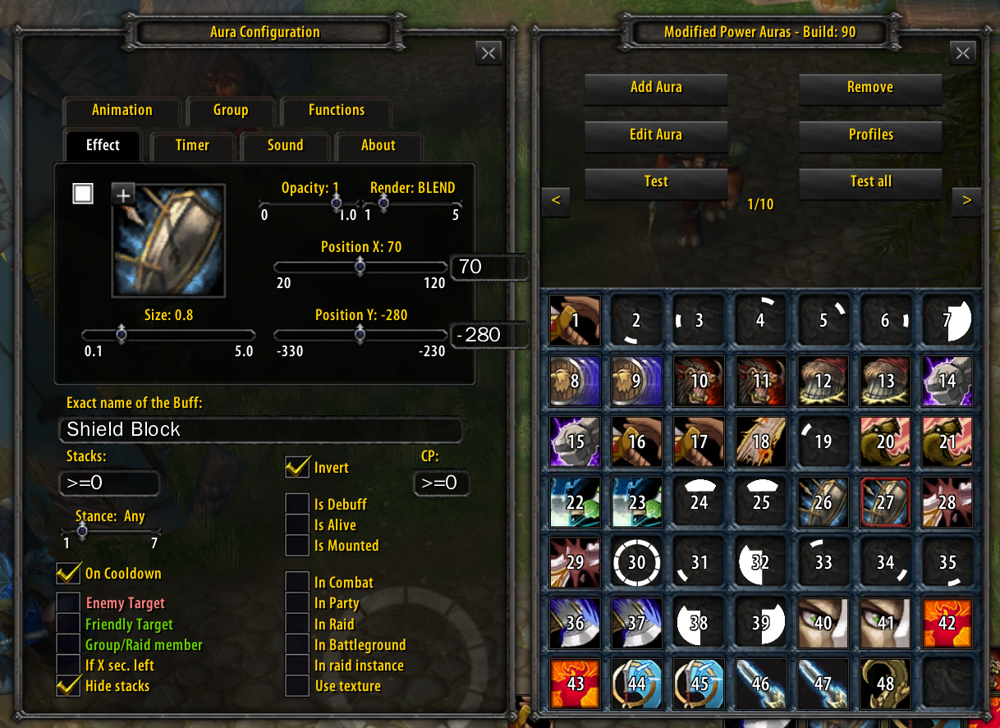

# Modified Power Auras (MPOWA)

This repo contains two separate AddOns;
- the forked Modified Power Auras (MPOWA) project
- the awesome ColorPickerPlus project from https://github.com/mrrosh/ColorPickerPlus which adds more useful color and has support for copy/paste of colors

### What is Modified Power Auras? ###

Modified Power Auras is the advanced version of the AddOn Power Auras. It is a lot more powerful and provides every possible function that could be backported from cataclysm. Plus it provides some custom features that are very helpful.

### What significant updates and changes have been made to the original?

- Bundling of ColorPickerPlus addon to allow HTML based color codes for consistent coloring
- Added support for Forms/Stances

### What are the advantages of Modified Power Auras? ###

* Use Icons instead of symbols
* More performant
* Show stacks of auras
* Show double procs (Holy strength)
* Show **enemy buffs and debuffs**
* Show your buffs and debuffs
* Show cooldown on trinkets or abilities
* Customize your aura and its position on the whole screen
* Use a lot new conditions to show/hide auras
* Play a sound if a aura is applied or fades
* Have some nice animations
* Group them as they appear
* Set up custom functions to show or hide the aura

### Installing Instructions ###

* Download the latest release of AddOn [here](https://github.com/kxseven/ModifiedPowerAuras/releases)
* Extract (or copy) both AddOns into your `Interface/AddOns` directory in your World of Warcraft folder
* Start the game
* In-game, you can use `/mpowa` or `/wa` to open the configuration frame
* Enjoy

### How does it look like? ###

**All frames opened (Profile/EditAura/IconFrame):**

**Auras on testmode:**
